# Atividade Prática 06 - T2

## PREPARAÇÃO DO AMBIENTE NO MOBA

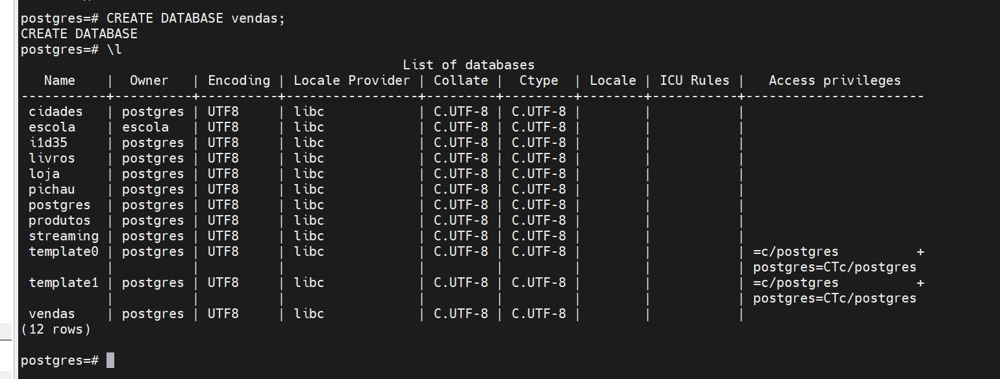

**ARQUIVO BAIXADO**

 

 ---

### PERGUNTAS DA GERENTE 

*BLOCO 1 — CONHECENDO A BASE*

### 01) Traga TODAS as colunas das 20 primeiras vendas cadastradas, só para ver a cara dos dados:

```sql
SELECT * FROM vendas LIMIT 20;
```
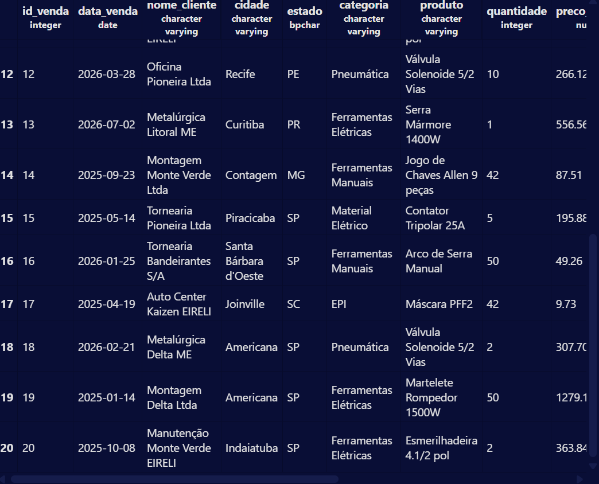

---

### 02) Quantas vendas existem registradas no total? Apelide o resultado de "total_de_vendas":

```sql

SELECT COUNT(*) AS total_de_vendas
FROM vendas;
```
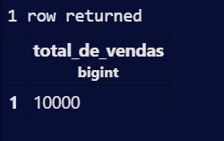

---

### 03) Quais são as categorias de produto que a empresa trabalha? Traga cada uma uma única vez, em ordem alfabética:

```sql
SELECT DISTINCT categoria
FROM vendas ORDER BY categoria ASC;
```
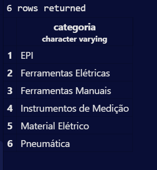

----

### 04) Em quais cidades e estados a empresa tem clientes? Traga cada combinação cidade/estado uma única vez, em ordem alfabética de cidade:

```sql
SELECT DISTINCT cidade, estado
FROM vendas
ORDER BY cidade;
```
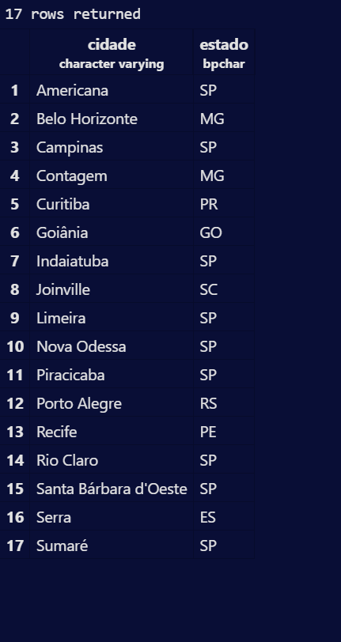

---

*BLOCO 2 — FILTRANDO COM WHERE*

### 05) A gerente quer revisar a linha de segurança. Liste o id, o produto, a quantidade e o preço unitário de todas as vendas da categoria 'EPI':

```sql
SELECT id_venda, produto, quantidade, preco_unitario
FROM vendas
WHERE categoria = 'EPI';
```

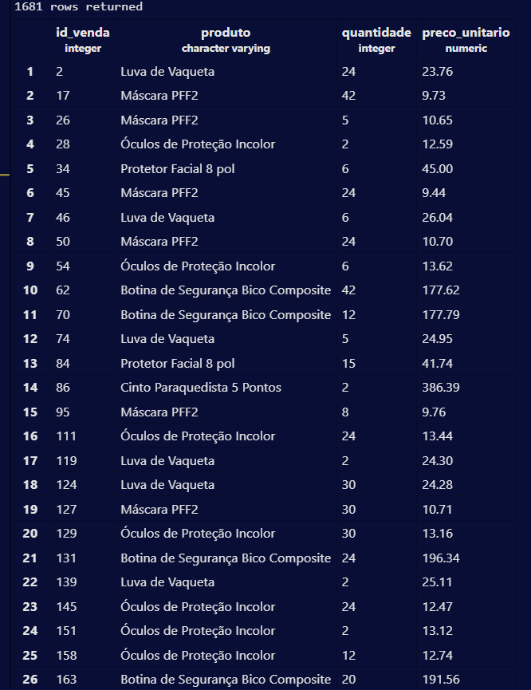

---

### 06) O setor fiscal quer conferir as vendas grandes e caras: liste as vendas com quantidade MAIOR que 40 unidades E preço unitário ACIMA de R$ 300,00:

```sql
SELECT *
FROM vendas
WHERE quantidade > 40
AND preco_unitario > 300;
```

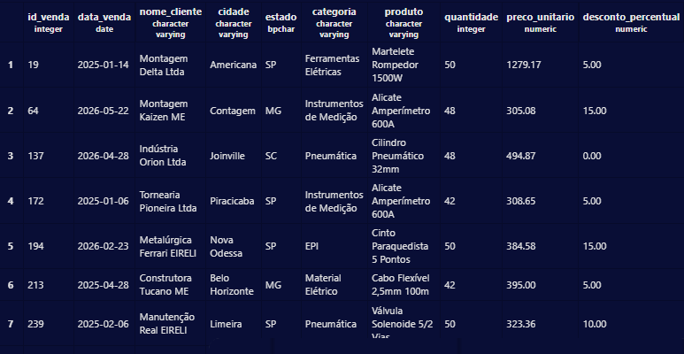

---

### 07) A diretoria vai fazer uma visita à região de Campinas. Liste id, cliente, cidade e produto das vendas feitas para clientes de Americana, Campinas e Piracicaba. (Use IN.):

```sql
SELECT id_venda, nome_cliente, cidade, produto
FROM vendas
WHERE cidade IN ('Americana', 'Campinas', 'Piracicaba');
```

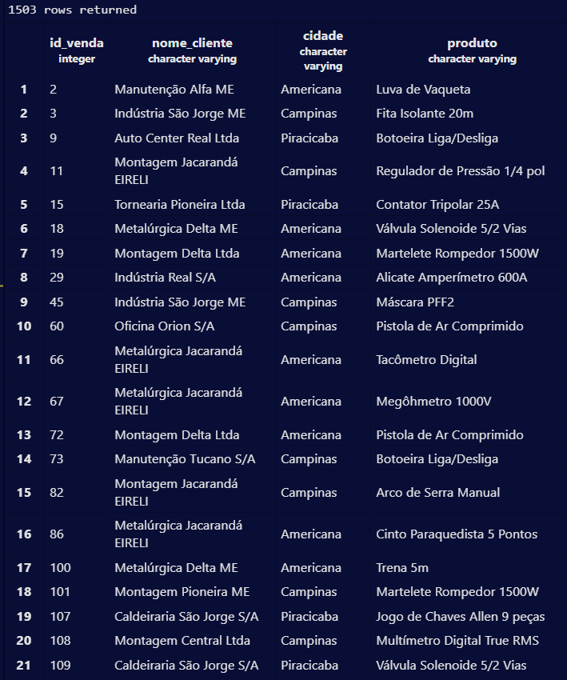

---

### 08) Fechamento mensal: liste id, data, cliente e produto de todas as vendas realizadas em MARÇO DE 2026, ordenadas por data:

```sql
SELECT id_venda, data_venda, nome_cliente, produto
FROM vendas
WHERE data_venda >= '2026-03-01'
  AND data_venda < '2026-04-01'
ORDER BY data_venda;
```

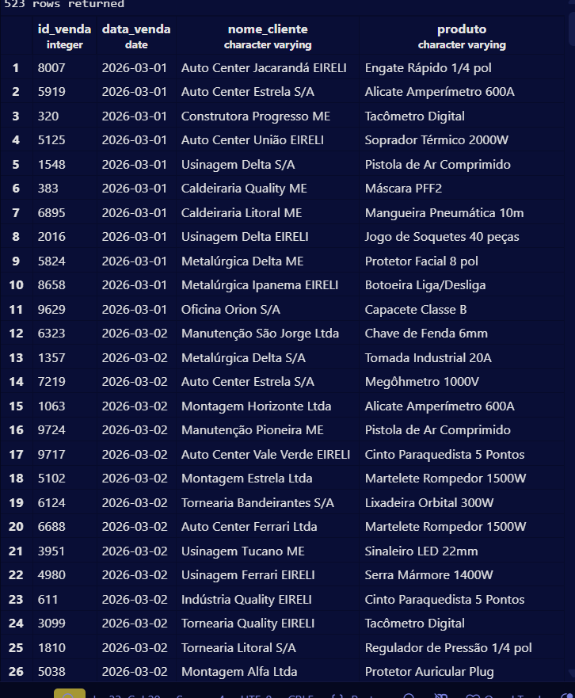

---

### 09) O jurídico precisa localizar os contratos das metalúrgicas. Liste as vendas cujo nome do cliente COMECE com "Metalúrgica":

```sql
SELECT *
FROM vendas
WHERE nome_cliente LIKE 'Metalúrgica%';
```
>O "%" significa “qualquer quantidade de caracteres”.

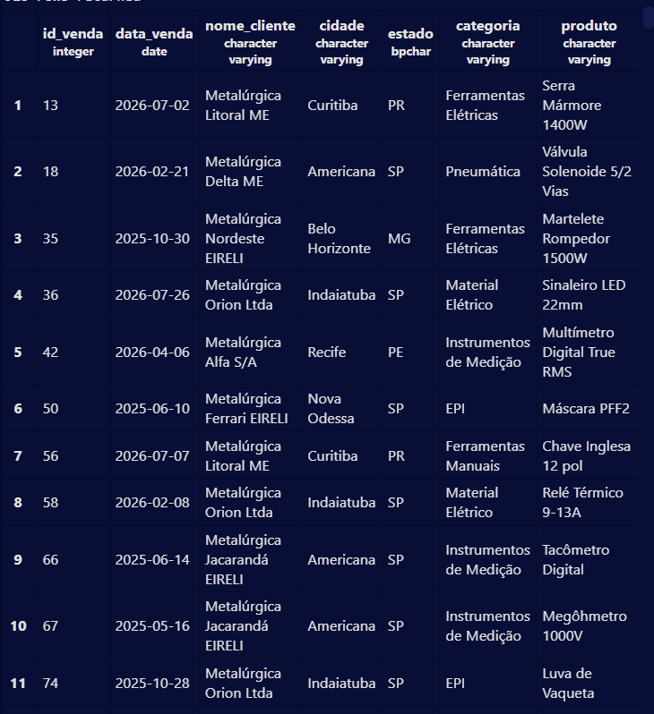

----

### 10) O financeiro quer investigar cancelamentos. Liste as vendas com status 'Cancelado' que foram pagas em Boleto ou PIX.

```sql

SELECT * FROM vendas
WHERE status_entrega = 'Cancelado'
AND forma_pagamento IN ('Boleto', 'PIX');
```
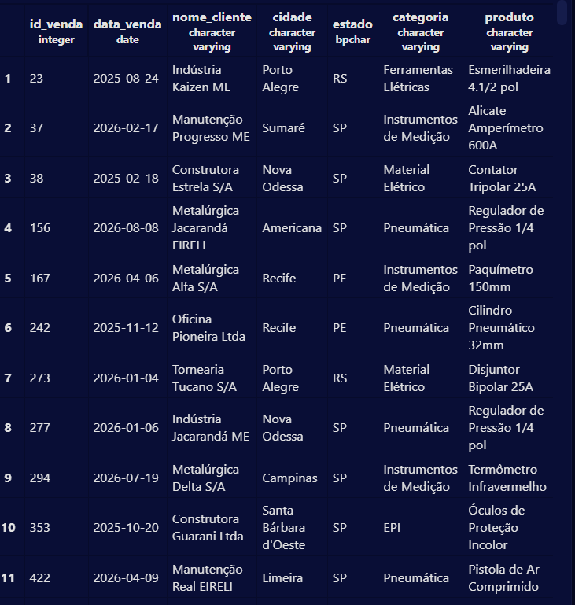

---

*BLOCO 3 — ORDENANDO OS RESULTADOS*

### 11) Quais são os 10 produtos vendidos com o MAIOR preço unitário? Traga id, produto e preço:

```sql
SELECT id_venda, produto, preco_unitario
FROM vendas
ORDER BY preco_unitario DESC
LIMIT 10;
```
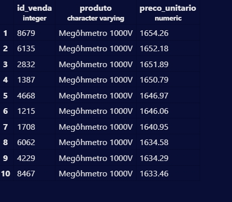

---

### 12) Quais foram as 5 vendas MAIS ANTIGAS da categoria 'Instrumentos de Medição'? Traga id, data, produto e cliente:

```sql
SELECT id_venda, data_venda, produto, nome_cliente
FROM vendas
WHERE categoria = 'Instrumentos de Medição'
ORDER BY data_venda ASC
LIMIT 5;
```

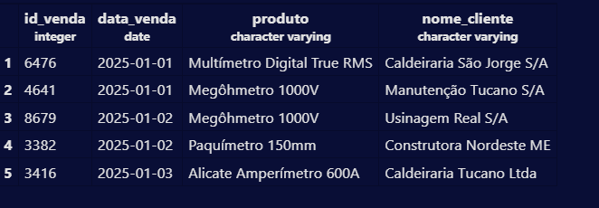

---

### 13) A vendedora Ana Ribeiro pediu o extrato dela. Liste as vendas dela da mais RECENTE para a mais antiga e, quando houver empate na data, da MAIOR para a menor quantidade. Mostre as 20 primeiras linhas:


```sql
SELECT *
FROM vendas
WHERE vendedor = 'Ana Ribeiro'
ORDER BY data_venda DESC, quantidade DESC
LIMIT 20;
```
----

*BLOCO 4 — CÁLCULOS E FUNÇÕES*

### 14) A tabela não guarda o valor da venda. Para a categoria'Ferramentas Elétricas', calcule o valor bruto de cada venda(quantidade x preço unitário), apelide de "valor_bruto" e traga as 10 maiores:

```sql
SELECT id_venda, produto, quantidade, preco_unitario, quantidade * preco_unitario AS valor_bruto
FROM vendas
WHERE categoria = 'Ferramentas Elétricas'
ORDER BY valor_bruto DESC
LIMIT 10;
```
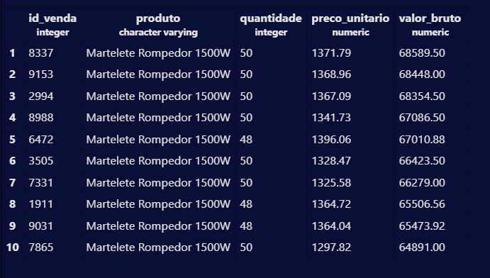

---

### 15) Agora considerando o desconto: calcule o valor líquido de cada venda, ou seja, o valor bruto menos o percentual de desconto. Apelide de "valor_liquido". Considere apenas as vendas que TIVERAM desconto e traga as 10 maiores. DICA: desconto_percentual está em %, então lembre de dividir por 100 na conta:

```sql
SELECT id_venda, produto, quantidade, preco_unitario, desconto_percentual, (quantidade * preco_unitario) -
(quantidade * preco_unitario * desconto_percentual / 100) AS valor_liquido
FROM vendas
WHERE desconto_percentual > 0
ORDER BY valor_liquido DESC
LIMIT 10;
```
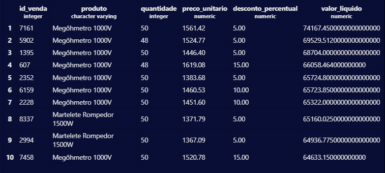

---
### 16) Duas respostas para a diretoria:

*a) Qual é o FATURAMENTO BRUTO TOTAL da empresa (soma do valor bruto de todas as vendas)?*

```sql

SELECT SUM(quantidade * preco_unitario) AS faturamento_bruto
FROM vendas;
```
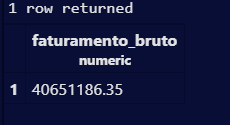

*b) Qual é o faturamento bruto apenas da categoria 'EPI'?*

```sql
SELECT SUM(quantidade * preco_unitario) AS faturamento_bruto
FROM vendas
WHERE categoria = 'EPI';
```


---

### 17) Sobre o estado de São Paulo, traga em UMA ÚNICA consulta: o ticket médio (valor bruto médio), a maior venda, a menor venda e a quantidade de vendas. Apelide todas as colunas com nomes claros em português:

```sql

SELECT AVG(quantidade * preco_unitario) AS ticket_medio,
MAX(quantidade * preco_unitario) AS maior_venda, MIN(quantidade * preco_unitario) AS menor_venda,COUNT(*) AS quantidade_vendas
FROM vendas
WHERE estado = 'SP';
```


---

*BLOCO 5 — MANUTENÇÃO DOS DADOS*

### 18) Chegou um pedido novo no balcão. Cadastre uma venda com dados de sua escolha (cliente, produto e valores realistas, data de hoje).ATENÇÃO: o campo id_venda é chave primária e não é automático — use um número ainda não utilizado (10001 em diante).Depois, comprove com um SELECT que a venda foi gravada:

```sql
INSERT INTO vendas (
    id_venda, data_venda, nome_cliente, cidade, estado, produto,
    categoria, quantidade, preco_unitario, desconto_percentual,
    forma_pagamento, status_entrega, vendedor
)
VALUES (
    10001, '2026-09-15', 'Empresa Silva Ltda', 'Americana', 'SP',
    'Furadeira', 'Ferramentas Elétricas', 2, 450.00, 5,
    'PIX', 'Concluído', 'Ana Ribeiro'
);

SELECT *
FROM vendas
WHERE id_venda = 10001;
```

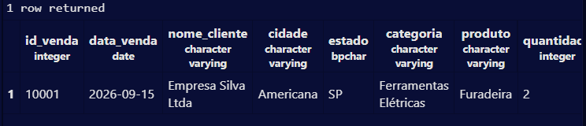

---

### 19) O cliente ligou desistindo da compra. Altere o status_entrega da venda que VOCÊ cadastrou para 'Cancelado'. Comprove com SELECT.CUIDADO: um UPDATE sem WHERE altera a tabela inteira:

```sql
UPDATE vendas
SET status_entrega = 'Cancelado'
WHERE id_venda = 10001;

SELECT *
FROM vendas
WHERE id_venda = 10001;
```
---

### 20) Encerrando o teste: exclua a venda que você cadastrou e, em seguida, execute um COUNT(*) mostrando que a tabela voltou a ter 10.000 registros:

```sql
DELETE FROM vendas
WHERE id_venda = 10001;

SELECT COUNT(*) AS total_registros
FROM vendas;
```

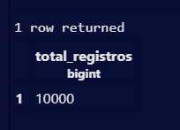

